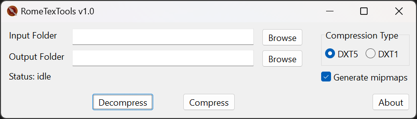

# RomeTexTools

Graphical frontend to handle common texture operations for _Rome: Total War_ modding.

## Features

- Compress textures to DDS+LZ4
- Select DDS compression formats: DXT1 or DXT5
- Decompress LZ4-compressed textures
- Optionally generate mipmaps when compressing

## Download

Visit the [**Releases**](https://gitlab.com/eb-online/tools/rometextools/-/releases) page to download the latest package.

## Notes

The input folder may have subfolders but must only contain images.

**Any existing files in the output with the same name as input files will be overwritten without warning!**

## Licenses

As this project depends on [LZ4](https://github.com/lz4/lz4) and [Texconv](https://github.com/Microsoft/DirectXTex/wiki/Texconv), the licenses for those tools are included.

Brought to you by the EB Online Team
